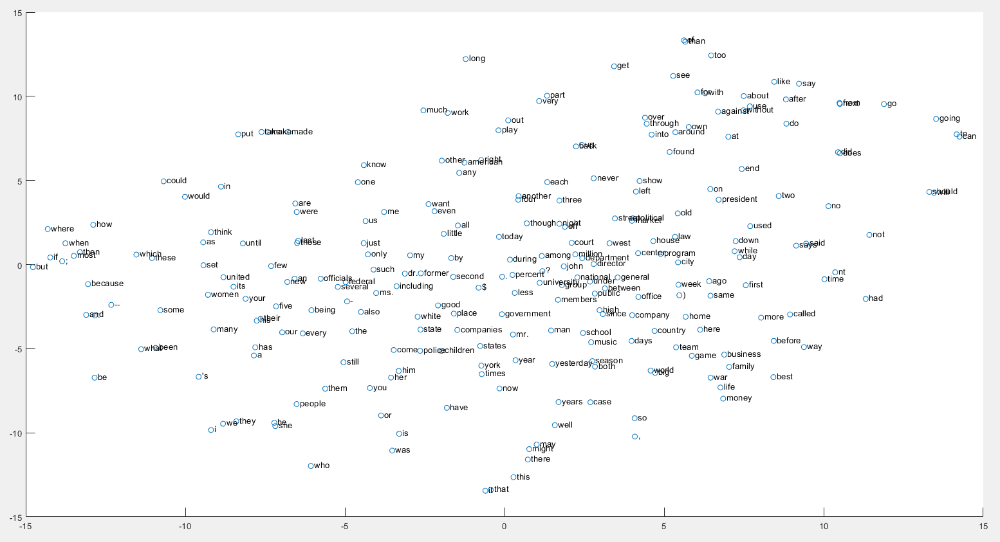
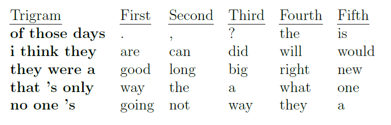
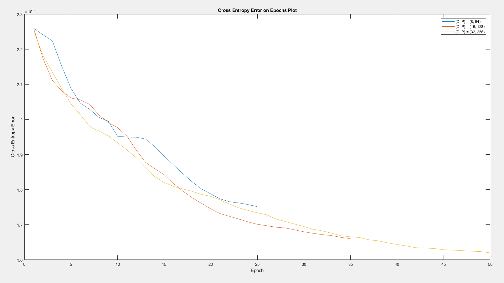

# Neural Probabilistic Language Model
Bengio's Neural Probabilistic Language Model implemented in Matlab which includes t-SNE representations for word embeddings.

Matlab implementation can be found on [nlpm.m](./nlpm.m).

## Embeddings

As expected, words with closest meaning or use case(like being question word, or being
pronoun) appeared together. (i.e. similar words appear together.) Some of the examples I
found:

"i, we, they, he, she, people, them" appear together on bottom left.

"said, says" appear together on middle right.

"did, does" appear together on top right.

"going, go" appear together on top right.

"no, 'nt, not" appear together on middle right.

"him, her, you" appear together on bottom left.

## Semantics of Predictions

The network's predictions make sense because they t in the context of trigram. For
example, if I would predict the next word of "i think they", I would say "are, would, can,
did, will" as network did. "No one's going", or "that's only way" also good ts. The network
also predicted that there should be an adjective after "they were a" and that is also sensible
since we can put noun after it. "of those days" sounds like the end of the sentence and the
network predicted some punctuations lilke ".", ",", "?".

## Training
I chose the learning rate as $0.005$, momentum rate as $0.86$, and initial weights' std as $0.05$. I selected learning rate this low to prevent exploding gradient.

Blue line and red line are shorter because their cross entropy started to grow at these
cut points. Since the orange line is the best tting line and it's the experiment with the
most number of hidden neurons (P = 64), its capacity is the highest among them. In the
experiments (D; P) = (8; 64), and (D; P) = (16; 128), the network started to predict "." for
every trigram input. It is the most probable output for many of the entities in training set.
However, it is not sensible. Thus, the network needed to be early stopped.
Although cross entropy is a good error measure since it ts softmax, I also measured
the accuracy for whether the output with highest probability matches the expected output.
I obtained the following results: Accuracy on settings (D; P) = (8; 64) was 30.11% for
validation set, and 29.87% for test set. Accuracy on settings (D; P) = (16; 128) was 31.15%
for validation set, and 31.29 for test set. Accuracy on settings (D; P) = (16; 128) was 33.01%
for validation set, and 32.76% for test set.

## References
* Bengio, Yoshua, et al. "A neural probabilistic language model." Journal of machine learning research 3.Feb (2003): 1137-1155.
